##  Amazon_Vine_Analysis by Nayan Patel(PM)

# Project Owner: Jennifer

# Project Sponser : SellBy stakeholders.

# Project Purpose : analyzing Amazon reviews

# Project Purpose: 

The Amazon Vine program is a service that allows manufacturers and publishers to receive reviews for their products. Companies pay a small fee to Amazon and provide products to Amazon Vine members, who are then required to publish a review.

So,  analyzing Amazon reviews written by members of the paid Amazon Vine program can help find summary analysis

## Resurces: 

- Data Set access that contains reviews of a specific product, from clothing apparel to wireless products. This project is to work on wireless products datasets and use PySpark to perform the ETL process to extract the dataset, transform the data, connect to an AWS RDS instance, and load the transformed data into pgAdmin. Also with use of PySpark, Pandas, or SQL to determine if there is any bias toward favorable reviews from Vine members in your dataset. 

## Deliverables:

Deliverable 1: Perform ETL on Amazon Product Reviews

Deliverable 2: Determine Bias of Vine Reviews

Deliverable 3: A Written Report on the Analysis .

## ETL Resources: Colab-

1. 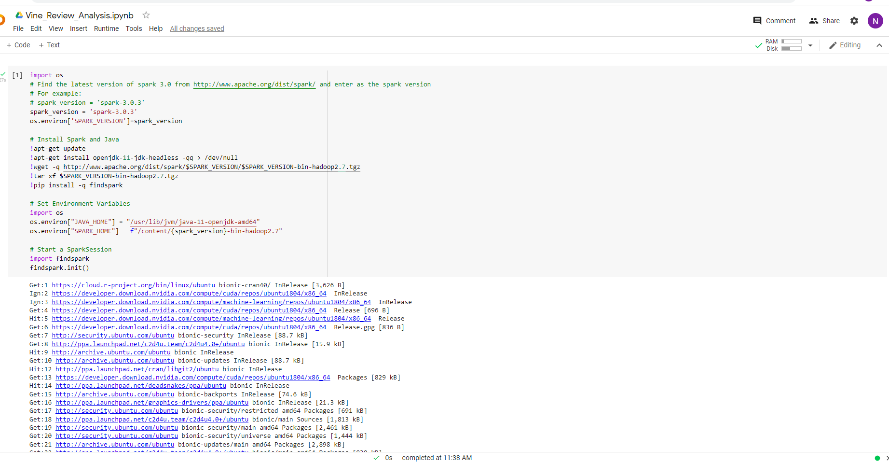
   
2. 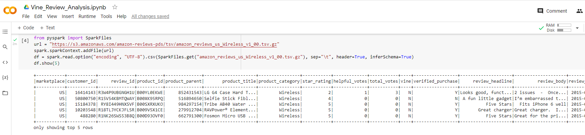
   
3. 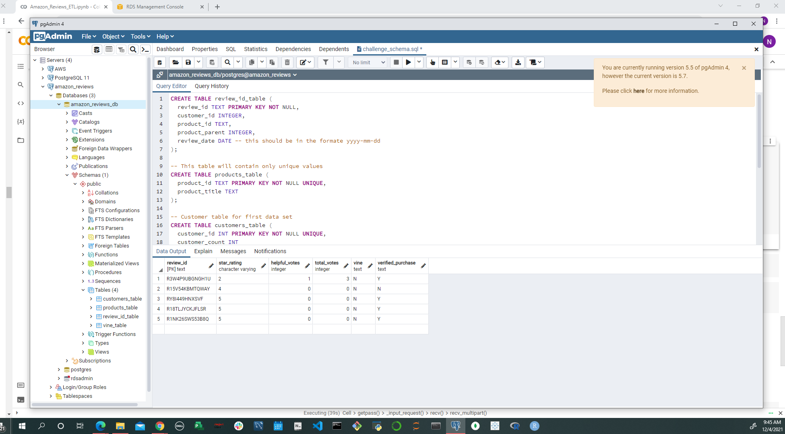

4. 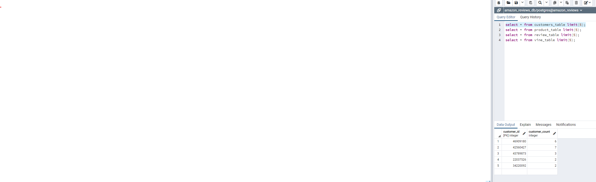

5. 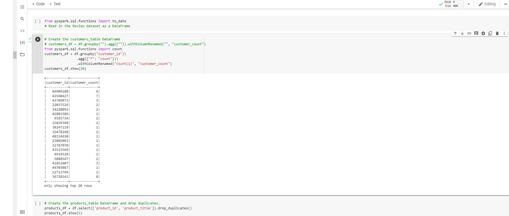
   
6. 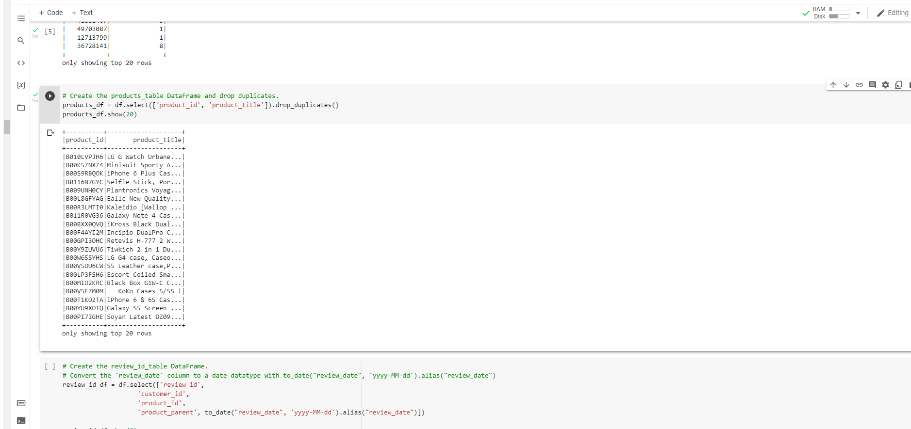
   
7. 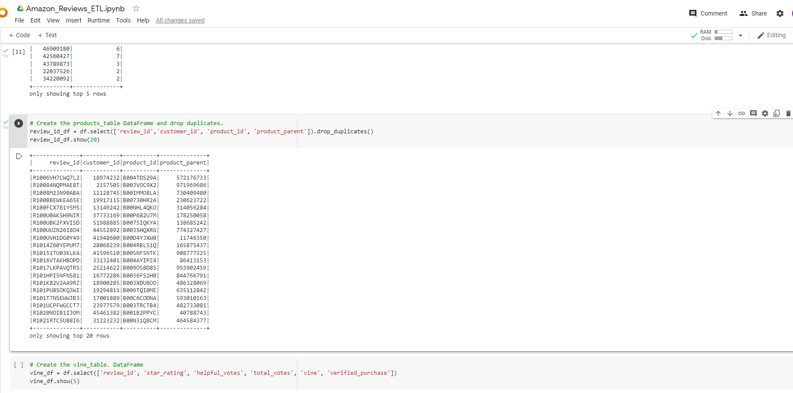

7. 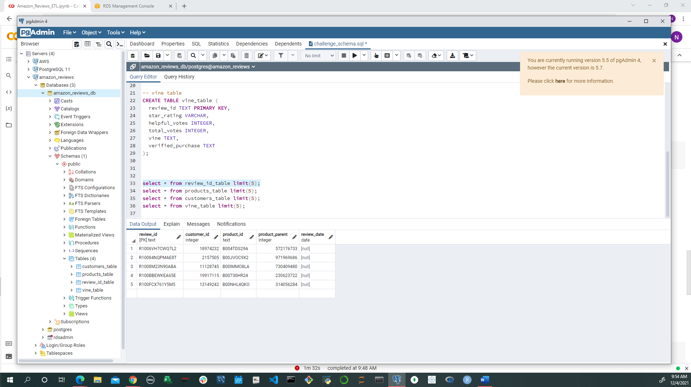
   
8. 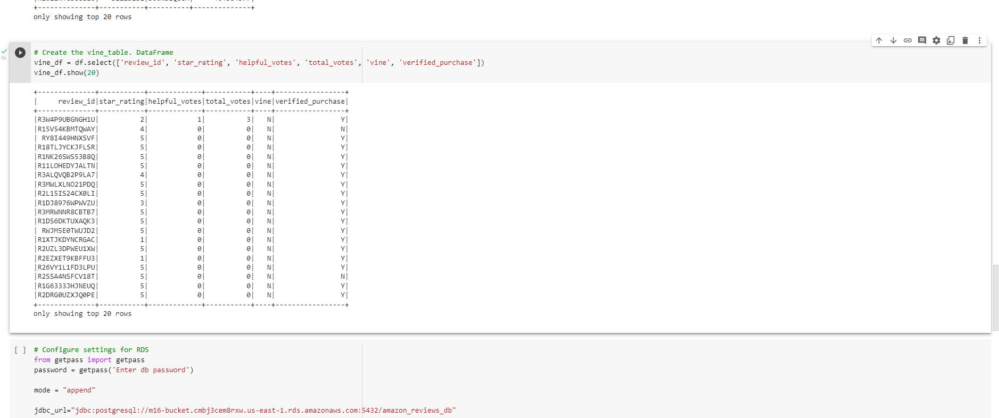

## Creating Vine Reiew:

1. 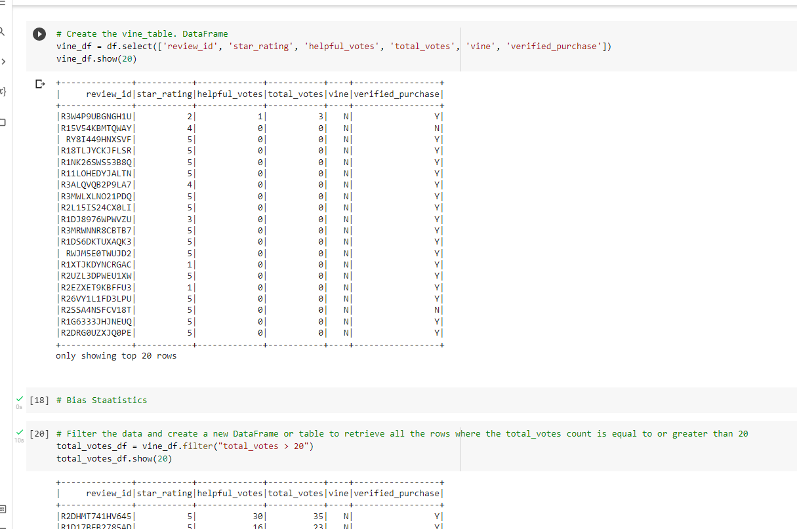

2. 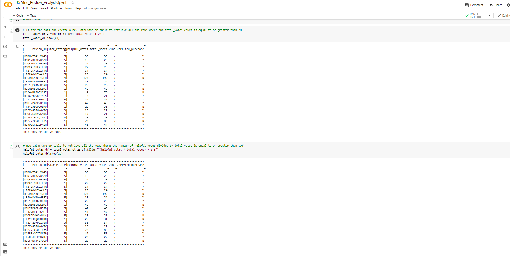

3. 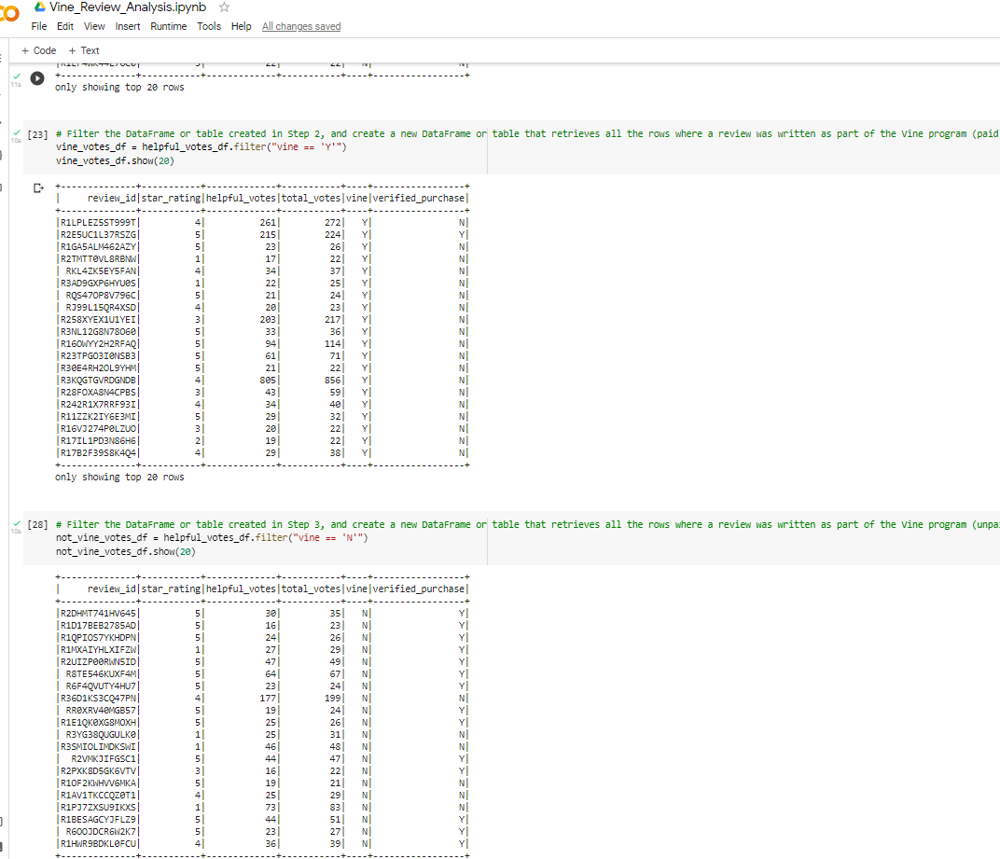

4. 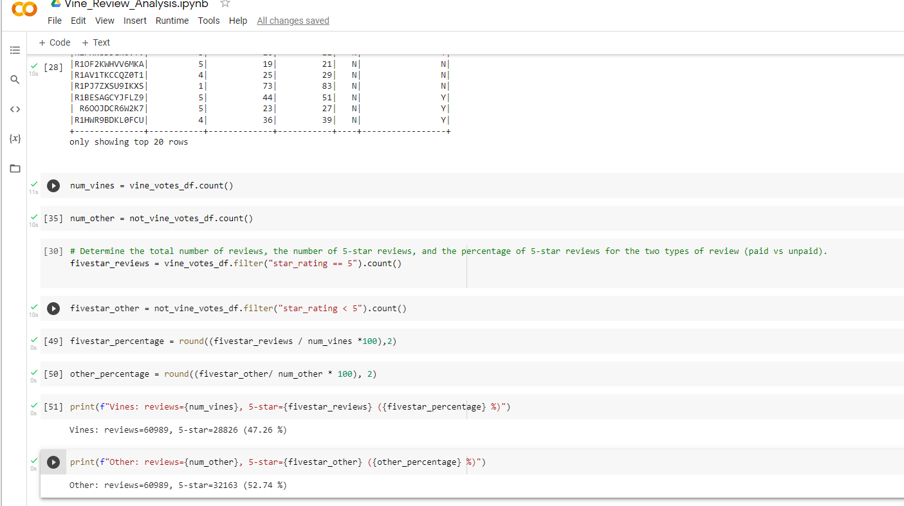

## Summary

The more spread out a distribution is, the more variability it has. The standard deviation of the sampling distribution is the estimator of the population standard deviation. If the standard deviation of the sampling distribution is equal to population standard deviation, it is said that the standard deviation of sampling distribution is the consistent estimator. High variability can be fixed by increasing sample size, but if sample does have high bias, there is no statistical way to fix it. 

A sampling distribution has a minimum amount of variability (spread) if all samples have statistics that are approximately equivalent to one another.  It is impossible to have no variability, due to the nature of random sampling. However, a larger sample size will minimize variability in a sampling distribution.  

This sample is unbiased as the estimator value (sample statistic) is  almost in range of the population parameter. Thw Sample has Minimum Variability
